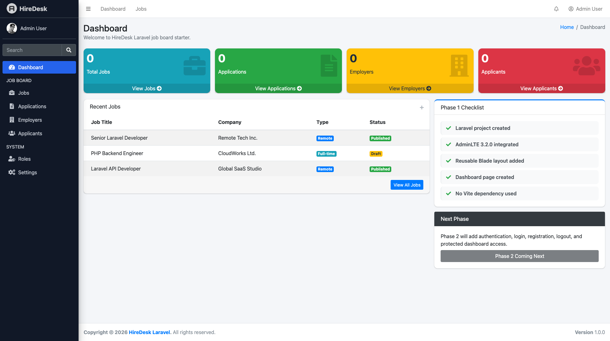

# Laravel AdminLTE Starter

**Laravel AdminLTE Starter** is a free and open-source Laravel 12 starter project built with **AdminLTE 3.2.0**, **Blade**, **Bootstrap 4**, and **jQuery**. It provides a clean Laravel admin dashboard foundation without Vite, making it easy for developers to start building admin panels, dashboards, CRUD systems, SaaS backends, internal tools, CRM systems, job boards, and business web applications.

This starter is designed for Laravel developers, freelancers, agencies, and students who want a simple, clean, and practical Laravel AdminLTE setup without spending time on manual dashboard integration.

---

## 🚀 Project Overview

This repository provides a ready-to-use Laravel 12 + AdminLTE 3.2.0 starter structure.

It includes the basic foundation required for most Laravel admin panel projects:

- AdminLTE dashboard layout
- Reusable Blade template structure
- Sidebar partial
- Navbar partial
- Footer partial
- Public asset organization
- Custom CSS and JavaScript files
- Clean dashboard page
- No Vite dependency
- Simple Laravel Blade-based frontend setup

This project can be used as a starter template for client projects, SaaS applications, internal business tools, admin dashboards, job portals, CRM systems, HR platforms, inventory systems, and Laravel learning projects.

---

## 🎯 Why Use This Starter?

Many Laravel starter kits are either too simple or too heavy for real-world admin panel projects.

This starter gives you a practical foundation with:

- Laravel 12
- AdminLTE 3.2.0
- Bootstrap 4
- Blade templates
- Manual asset integration
- No Vite setup
- Clean folder structure
- Easy customization
- Beginner-friendly codebase

It is ideal if you want to quickly start building a Laravel admin panel without setting up AdminLTE manually from scratch.

---

### Laravel + AdminLTE Starter Foundation

The current version includes the first foundation phase of the project.

### Completed Features

- Fresh Laravel 12 project setup
- AdminLTE 3.2.0 manual integration
- No Vite dependency
- Reusable Blade layout
- Admin sidebar
- Top navbar
- Footer partial
- Dashboard page
- Public asset structure
- Custom CSS file
- Custom JavaScript file
- Clean starter dashboard
- Ready structure for future modules
- Beginner-friendly Laravel admin panel setup

---

## 🧩 Use Cases

You can use this starter to build:

- Laravel admin panel
- Laravel dashboard
- Laravel CRUD application
- Laravel SaaS admin dashboard
- Laravel CRM system
- Laravel ERP system
- Laravel HR management system
- Laravel job board admin panel
- Laravel inventory management system
- Laravel school management system
- Laravel hospital management system
- Laravel client project starter
- Laravel internal business dashboard
- Laravel backend management panel
- Laravel AdminLTE boilerplate

---

## 🖥️ Tech Stack

| Technology | Version / Details |
|---|---|
| Laravel | 12.x |
| PHP | 8.2+ recommended |
| Admin Template | AdminLTE 3.2.0 |
| Frontend | Blade, Bootstrap 4, jQuery |
| Build Tool | No Vite |
| Database | MySQL / MariaDB |
| Styling | AdminLTE CSS + Custom CSS |
| JavaScript | AdminLTE JS + Custom JS |

---

## 📁 Project Structure

```txt
laravel-adminlte-starter/
├── app/
├── bootstrap/
├── config/
├── database/
├── public/
│   ├── assets/
│   │   ├── adminlte/
│   │   ├── css/
│   │   └── js/
├── resources/
│   └── views/
│       ├── layouts/
│       │   └── app.blade.php
│       ├── partials/
│       │   ├── navbar.blade.php
│       │   ├── sidebar.blade.php
│       │   └── footer.blade.php
│       └── dashboard.blade.php
├── routes/
│   └── web.php
├── .env.example
├── artisan
├── composer.json
└── README.md


## ⚙️ Installation

Clone the repository:

```bash
git clone https://github.com/hasancse06/Laravel-AdminLTE-Starter.git
cd hiredesk-laravel
```

Install PHP dependencies:

```bash
composer install
```

Copy the environment file:

```bash
cp .env.example .env
```

Generate application key:

```bash
php artisan key:generate
```

Configure your database in `.env`:

```env
DB_CONNECTION=mysql
DB_HOST=127.0.0.1
DB_PORT=3306
DB_DATABASE=hiredesk
DB_USERNAME=root
DB_PASSWORD=
```

Run migrations:

```bash
php artisan migrate
```

Clear and optimize:

```bash
php artisan optimize:clear
```

Run the project locally:

```bash
php artisan serve
```

Or, if you are using Laravel Herd, open:

```txt
https://hiredesk-laravel.test
```

## 🙌 Author

**M A Hasan**  
- 🔭 Full-Stack Web Developer | Laravel, WordPress, WooCommerce, Ionic Framework with Angular & REST APIs
- 🌐 About Me [https://hasan.online](https://hasan.online)
- 🎓 Instructor on [Udemy](https://www.udemy.com/user/m-a-hasan-2/)
- 🧠 Creator at [Envato](https://themeforest.net/user/hasanonline)
- ✍️ Blogger at [blog.hasan.online](https://blog.hasan.online)


## ⭐ Support This Project

If you find this useful:
- ⭐ Star the repository on GitHub
- 🔗 Share it with fellow Laravel, Ionic + Angular, WordPress, WooCommerce and Mobile App Developers
- 💡 Contribute with feedback or pull requests


## Screenshots

### Dashboard


